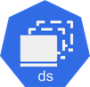
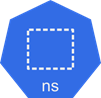

# 03_Kubernetes Object

> 다양한 쿠버네티스 오브젝트에 대한 개념 정리

<br>

## 1. 워크로드 리소스(Workload Resources)

> 어플리케이션을 실행하는 컨테이너를 관리하는 오브젝트

### 1) 기본 오브젝트

#### (1) 파드(Pod)

> 쿠버네티스가 상호작용하는 가장 작은 단위로, 컨테이너화된 어플리케이션을 실행 중인 작업 실행 단위


하나 또는 그 이상의 컨테이너를 가지나, 보통 `하나의 파드에는 1개의 컨테이너와 1개의 볼륨(1 Pod per 1 Container 1 Volume)`으로 구성된다. (멀티 컨테이너로 구성될 수도 있다.)

컨테이너 구동을 위한 자원(볼륨, 환경 설정 정보 등)을 요구한다.

다른 파드나 외부로 소통이 가능하지만, 디폴트로 클러스터 내부 IP주소가 있어서 파드 또는 해당 파드 내의 컨테이너에 요청을 보낼 때 사용할 수 있다.

- 특징

  - Pod는 임시적(ephemeral)이다
    - 지속적이지 않다(not permenant); 파드 재생성 시 ip도 변경된다.(동적 할당)
    - 언제든지 쿠버네티스에 의해서 삭제되고 다시 생성될 수 있다; 도커 컨테이너와 유사

  - 사용자가 직접 pod를 강제로 생성/수정/삭제할 수 있지만 이는 쿠버네티스가 자동으로 해야 하는 작업이다.


<br>

### 2) 컨트롤러 오브젝트

관리 성격을 가진 오브젝트

#### (1) 디플로이먼트(Deployment)

> 파드의 배포를 관리하며, 일반적으로 레플리카 셋과 함께 사용되는 오브젝트


쿠버네티스에서 가장 널리 사용되는 오브젝트로 레플리카셋을 이용해서 파드를 업데이트하고 이력을 관리하거나 롤백(Rollback) 또는 특정 버전으로 되돌아갈 수 있게함(Revision)

#### (2) 레플리카 셋(Replica Set)

> 파드 수를 생성/복제하고 관리/모니터링하는 오브젝트


복제할 파드의 개수, 개수를 모니터링할 라벨 선택자, 생성할 파드의 설정값(템플릿) 등을 갖고 있음.

레플리카 셋 단독으로 사용이 가능하긴 하지만 일반적으로 단독으로 사용되는 경우는 거의 없다. 보통 디플로이먼트와 함께 사용된다.

※ 디플로이먼트의 yml에 `replicas`를 지정하면 레플리카 셋에 대한 yml이 필요 없이 자동으로 레플리카 셋을 관리할 수 있다. (디플로이먼트에서 내부적으로 관리)

따라서 보통 디플로이먼트를 사용하고 레플리카 셋은 직접 생성하지 않고 옵션으로 "자동 생성되는 중간 단계"정도의 오브젝트로 볼 수 있다.

#### (3) 데몬 셋(DaemonSet)



클러스터 내 모든/특정 조건을 만족하는 노드에 대해 파드의 복사본 하나가 실행되도록 보장(한 파드씩만 실행되도록)하는 컨트롤러 오브젝트.

모니터링, 로그 수집용 파드에 대해서 적용

- 예) 그라파나 혹은 프로메테우스와 같이 모니터링, 로그 수집용 에이전트들은 보통 한 노드에 최소 하나씩은 꼭 필요함

#### (4) 잡(Job)


특정 작업을 한 번 실행하고 성공적으로 완료되면 Pod를 종료하는데 사용되는 오브젝트.

잡이 성공/실패되더라도 작업에 대한 결과 혹은 로그를 확인해야 하기 때문에 작업이 완료되더라도 파드는 삭제되지 않고 남아 있는 것이 특징이다.

#### (5) 크론 잡(CronJob)


작업(잡 오브젝트)이 주기적으로 실행되도록 예약하는 오브젝트. 

#### (6) 스테이트풀 셋(Stateful Set)

상태가 있는(stateful) 서비스(DB, Kafka 등)를 관리하기 위한 오브젝트 (TODO: 나중에 학습 후 정리)

<br>

## 2. 서비스 리소스(Service Resource)

> 네트워킹과 외부 접근을 관리하기 위한 리소스. 네트워킹, 로드밸런싱 리소스라고도 함.

TODO: 학습 후 추가 정리 예정

### (1) 서비스(Service)


> 네트워크와 관련된 오브젝트로, 파드를 외부 네트워크와 연결시켜주고, 워커 노드 내 로드 밸런서 역할을 하는 오브젝트

Load Balancer의 역할을 함 (※ 실제 흔히 말하는 로드 밸런서의 개념과는 다름)

서비스가 분배하는 통신은 해당 워커 노드에만 국한된다.

- 워커 노드 간 분배는 `인그레스(Ingress)`와 실제 `로드 밸런서(Load Balancer)`가 담당한다.
  - 이들은 별도의 노드에서 동작하거나 물리적인 하드웨어를 통해 구성된다.


<br>

## 3. 설정 & 스토리지 (Config & Storage)

> 컨피그 맵, 시크릿, 볼륨 등과 같은 쿠버네티스 오브젝트들에 대한 설정 및 저장소 역할을 하는 오브젝트

### 1) 환경 변수 관련

※ env file과 같은 파일을 컨피그 맵과 시크릿으로 사용하기 위해서는 해당 오브젝트를 생성할 때, `--from-file={경로/파일명}` 옵션을 지정해주면 되며, 시크릿의 경우 자동으로 Base64 인코딩이 되기 때문에 별도 인코딩을 해줄 필요가 없다. (하면 2번 인코딩되기 때문에 문제가 된다.)

※ 볼륨 마운트하여 파드와 연결할 경우에, 설정 파일의 내용이 변경되면 컨피그 맵과 시크릿의 설정 정보도 즉시 변경할 수 있다.

#### (1) 컨피그 맵(Config Map)


텍스트 설정(환경변수, 설정 파일 등)을 Pod에 주입하기 위한 용도의 오브젝트로, 암호화가 필요없는/비밀성이 없는 구성 정보에 사용한다.

key:value 형태로 내용을 작성한다.

```yml
apiVersion: v1
kind: ConfigMap
metadata:
  name: cm-dev
data:
  SSH: 'false'
  User: dev
```

#### (2) 시크릿(Secret)


민감한 데이터(비밀번호, 토큰 등)을 Pod에 주입하기 위한 용도의 오브젝트. 반드시 Base64로 인코딩을 해야 하며, 실제 파드 내부에서는 디코딩된다.

```yml
apiVersion: v1
kind: Secret
metadata:
  name: sec-dev
data:
  Key: MTIzNA==
```

### 2) 스토리지/볼륨

#### (1) 빈 경로(emptyDir)

파드 내에서 컨테이너 간 파일을 공유하기 위해 사용하는 볼륨.

파드가 삭제되면 볼륨의 내용은 모두 없어지기 때문에 삭제되어도 상관 없는 데이터를 저장한다.

#### (2) 호스트 패스(hostPath)

노드의 특정 경로(Path)를 파드 간 공유하기 위한 볼륨.

호스트 패스의 경우 보안 위험이 있어 운영 환경에서는 사용하지 않는 것이 권고된다.

또한 파드는 언제든지 삭제될 수 있고, 별도의 파드 스케줄링 설정이 없다면 항상 같은 노드에 생성되리라는 보장이 되지 않기 때문에 만약 볼륨을 사용 중인 파드가 다른 노드에 생성될 경우 정보를 사용하지 못하는 경우가 생길 수도 있다.

- type 옵션
  - DirectoryOrCreate: 실제 경로가 없다면 생성
  - Directory: 실제 경로를 지정 (경로가 없으면 오류가 발생)
  - FileOrCreate: 실제 경로에 파일이 없다면 생성
  - File: 파일을 지정 (실제 파일이 없으면 오류 발생)

#### (3) 퍼시스턴트 볼륨 클레임 / 퍼시스턴트 볼륨(PVC / PV)

파드에 영구적으로 볼륨을 할당하기 위한 리소스. Pod → PVC → PV 순으로 연결.

파드가 삭제 후 재생성되어도, PVC/PV를 통해 지정된 볼륨에 연결 가능하다는 특징이 있다.

- 동작 과정
  - PV를 먼저 정의하고 생성한 다음
  - PVC를 생성하면 해당 PVC와 PV는 연결된다.
  - 그 후 파드 생성 시 PVC와 연결되고 PV와 연결된 볼륨이 생성된다.
    - storageClassName을 ""(빈값)으로 설정하면 storageClassName을 사용하지 않아서 PVC에 파드가 연결되어야만 실제 볼륨이 생성된다.
    - Dynamic Provisioning에서 솔루션에서 제공하는 StorageClass이름을 storageClassName에 넣어서 사용하면 자동으로 PV를 생성하고, 만약 생략한다면 디폴트값으로 설정된 StorageClass가 추가된다. 

<br>

## 4. 클러스터 리소스(Cluster Resource)

### 1) Namespace



쿠버네티스 클러스터 안에서 리소스(파드, 서비스, 디플로이먼트 등)을 논리적으로 구분하기 위한 공간, 그룹의 개념.

- 특이사항
  - 같은 네임스페이스 안에서 같은 종류의 오브젝트는 이름이 동일해서는 안 됨.
  - 마찬가지로 서비스의 selector로 파드를 연결할 때 같은 네임스페이스 상에서만 연결 가능하다.
  - 단, 파드 간의 네트워크 통신이나 노드를 활용한 볼륨은 네임스페이스가 다르더라도 연결 및 공유가 가능하다.

- 주요 용도
  - 환경 분리 (dev/stg/prod)
  - 네임스페이스 간 리소스 할당/제한(ResourceQuota, LimitRange)
    - ResourceQuota; 특정 네임스페이스에서 리소스쿼터 설정 시 해당 네임스페이스 안에서 만들어지는 파드는 리소스 설정이 필수
    - LimitRage; 네임스페이스에 들어올 수 있는 파드의 자원을 제한시키는 역할


Node - 워커 머신
ServiceAccount - Pod의 인증 정보
Role / ClusterRole - 권한 정의
RoleBinding / ClusterRoleBinding - 권한 할당
