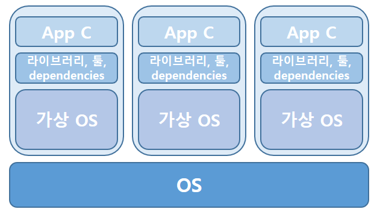
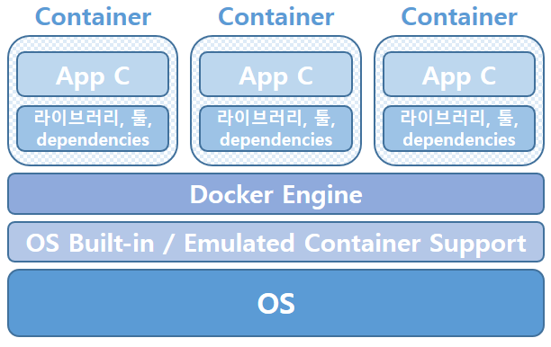

# Docker

## section #1

### 도커란 무엇인가?

> 도커는 컨테이너 기술로, 컨테이너를 생성하고 관리하기 위한 표준 도구이다

 

※ S/W에서 컨테이너란 무엇인가?

=> 표준화된 S/W 유닛

- 컨테이너 => 물건을 옮기는데 도움을 주는 도구; 표준화된 컨테이너가 있으면 그 곳에 있는 물건 들은 다른 곳과 섞이지 않음 해당 컨테이너만 옮기면 안의 물건들은 어디든 갈 수 있음

- 피크닉 바구니 => 접시, 음식이 담겨 있고, 친구와 피크닉 바구니를 공유 가능하고 어디에서든 안에 있는 내용물을 들고 이동해서 피크닉을 즐길 수 있음

 

### 컨테이너가 필요한 이유?

- 왜 컨테이너가 필요한가?
- 독립적인 표준화된 어플리케이션 패키지를 제공하는 이유?

#### 개발 환경 때문

동일한 개발 환경을 갖는다는 것은 굉장히 중요함. 어떤 곳에서는 해당 버전에 맞는 런타임 환경이 구축되어 있어서 바로 실행이 가능한 반면, 어떤 곳은 그렇지 못한 곳이 있음

큰 팀에는 동일한 프로젝트를 하지만 각 개개인의 개발 환경이 충분히 다를 수도 있음 => 만약 어떤 팀원이 프로그램 버전 업데이트를 한동안 안했다면 해당 팀원의 환경에서는 프로젝트가 구동되지 않을 수도 있음

혼자 작업하는 경우에도 유용; 작업하는 프로젝트가 여러 개일 경우 프로젝트의 사용 프로그램 버전 차이로 인해서 프로젝트 간 충돌 발생 가능성이 있음
=> 도커와 컨테이너의 개념을 적용하면 프로젝트 간 전환이 매우 쉬워짐. 각 환경(프로그램 버전 등)을 컨테이너별로 보관하고 각 프로젝트를 해당 컨테이너가 제공해주는 공간을 사용하게 함(각 프로젝트별로 개별 컨테이너를 가지게 함)

 

##### 컨테이너 안에 담긴 것들을 어디에서나 실행해도 항상 동일한 동작을 보장한다

##### 도커 컨테이너를 사용한다면 코드가 항상 정확한 버전으로 실행되도록 할 수 있음

##### 같은 코드 기반에서 함께 작업 가능, 항상 작동, 항상 같은 환경을 제공

 

### 가상 머신 VS 컨테이너

#### 의문점

"도커가 제공하는 기능을 가상 머신으로 해결하면 되는 거 아닌가??" => "Maybe"

 

#### 가상 머신(Virtual Machine)

가상 머신을 통해서 독립된 공간을 만들고 생산 가능함, 재생산 및 공유 가능

VM은 OS위에 설치하는 것임 따라서 해당 VM 안에 설치한 OS에 맞는 VM OS가 존재함

그러나 이는 문제가 있음. 어찌 됐든 VM은 OS 위에 설치되어있고 그 수가 다수라면 우리 OS의 자원(메모리, CPU)과 저장공간 등을 낭비하게 됨 => 점점 많아지면 많아질수록 OS의 오버헤드가 발생할 수 밖에 없음

또한, 매번 VM을 설치할 때마다 설정을 해줘야하며, 해당 설정을 직접 해야하기 때문에 100% 동일한 VM 환경이라고 볼 수 없음

개발에서 제품 생산으로 어플리케이션을 배포하려면 해당 프로젝트를 작업했던 VM 환경과 동일한 방식, 환경의 프로덕션 머신을 구성해야한다는 단점 존재

 

#### 컨테이너(Container)

하나의 OS 위에 해당 OS가 기본적으로 내재하고 있거나 컨테이너 에뮬레이터를 지원하는 내장 컨테이너를 사용하여 도커 엔진이 컨테이너를 구축함

컨테이너는 VM과 달리 OS에 미치는 영향이 적고, 속도도 빠르고, 용량이 작음, 공유 가능(배포 및 재구축이 쉬움), 앱과 앱의 실행에 필요한 것들만 캡슐화할 수 있음

반면, VM은 OS에 많은 영향을 끼치고, 상대적으로 느리고, 많은 공간을 차지함, 공유/재구축이 컨테이너에 비해 힘듦. 환경을 캡슐화하긴 하지만 앱과 앱 실행에 필요한 것들 뿐만 아니라 컴퓨터 전체를 캡슐화하는 개념임

=> 컨테이너의 최대 장점은 동일한 환경을 다른 사람과 공유 가능하다는 점

 

#### ※ 도커 설치

리눅스는 도커 엔진을 기본적으로 지원함. 따라서 사실상 별도로 설치할 필요가 없음

그러나 윈도우나, MacOS의 경우 Docker Desktop을 설치해야 Docker를 사용 가능함

WSL2는 윈도우 내부에 리눅스를 설치하는 개념이라고 이해하는 것이 편함

 

### 명령어

- `docker build .` : 현재 도커 파일 내용을 토대로 이미지를 빌드함
- `docker run <이미지 ID>` : 빌드한 이미지를 연결/실행함 => 실행하면 마치 서버가 켜진 상태라고 보는 것이 편함
  - `docker run -p 3000:80 <이미지 ID>` : 이미지를  3000번 포트에 publish하여 실행함
    - 3000 : 로컬 포트 / 80 : 내부 도커 컨테이너 노출 포트(EXPOSE를 통해 지정한 포트)
- `docker ps` : 현재 실행 중인 컨테이너 리스트를 출력함 ※ 이미지를 실행 중이라면 새로운 터미널에서 입력
  - `docker ps -a` : ps는 프로세스, -a는 all의 의미

- `docker stop <컨테이너 이름>` : 컨테이너를 중지함 ※ 시간이 조금 걸릴 수도 있음
- `docker run -it <이미지/런타임 명>` : 예) docker run -it node => 컨테이너 내부에서 node.js 환경을 실행

 

## section #2

### 이미지와 컨테이너

#### 컨테이너

Unit of S/W

 

#### 이미지

컨테이너의 설계도/템플릿 + 코드/필요 툴 및 환경 => 공유 가능한 패키지의 개념

##### ☆★ 컨테이너는 이미지의 구체적인 실행 인스턴스(이미지 기반의 컨테이너) ★☆

build 명령어를 통해 이미지를 만들고, run 명령어를 통해 이미지의 인스턴스인 컨테이너를 만듦

(흔히 run <이미지명> 명령어를 보고 이미지를 실행한다고 착각하기 쉽지만, 실행하는 것은 이미지가 아니라 이미지를 기반으로 하는 컨테이너를 실행하는 것임)

※ 이미지에서 명시한 실행환경이 없더라도 도커 허브에서 해당 실행환경 이미지를 불러와서 이미지를 커스텀하는 것이 가능함

 

### 레이어 기반의 아키텍쳐

#### 이미지의 특징; Read Only

이미지는 '읽기 전용'이며, 일단 이미지가 한번 빌드된 후에는 소스코드를 변경하더라도 컨테이너 재시작 시 소스코드에 변경한 내용이 반영되지 않음 => 이미지를 리빌딩(re-building)해줘야 소스코드의 변경된 내용이 반영됨. 즉, 이미지는 한번 빌드하고 나면  빌드된 그 당시의 상태로 lock되는 snapshot의 개념

다수의 개별 컨테이너는 동일한 이미지를 기반으로 할 수 있지만 컨테이너 간에는 서로 완전히 독립적임

각 이미지 레이어들은 빌드(생성) 후 캐시(cache)되고, 도커는 현재의 실행이 이전과 동일하다고 판단되면 캐시를 사용함(동일 작업에 대해 속도를 최적화하기 위함). 대신 만약 어떤 이미지의 레이어가 변경되었으면, 그 후속 레이어도 전부 변경됐다고 가정하고 다시 빌드하며 이때 캐시를 사용하지 않음

 

### Dockerfile

이미지 빌드 파일에 명령어는 모두 대문자로 쓴다 

- `FROM` : 다른 이미지 파일을 불러옴 import의 개념
  - FROM node : node.js에 대한 실행환경이 로컬에 있든 없든, 도커 허브에서 node.js 실행환경에 대한 이미지를 불러와서 커스텀하여 사용함
- `WORKDIR` : RUN명령어에 대한 작업 공간을 WORKDIR에 한정시킨다는 의미. 지정하지 않을 시 루트가 기본값임. 여기에 나와있는 /app은 실제 있는 폴더가 아니고 컨테이너 안에 존재하는 내부의 폴더임
- `COPY` : 어떤 파일이 이미지에 빌드되어야 하는지 지정(복사)함.
  - COPY . .에서 첫번째 . 은 현재 디렉토리, 두번째 . 은 해당 파일을 저장(복사)해야하는 이미지 내부의 경로를 의미 ※ 모든 이미지와 컨테이너에는 자체 내부 파일 시스템이 존재함
  - COPY . /app으로 쓸 경우 모든 파일이 app이라는 폴더에 복사되며, 폴더가 없을 경우 생성함
- `EXPOSE` : 우리의 로컬 시스템에 특정 포트를 연다고 도커에게 알려줌. 그러나 문서화하는 것 뿐이지 실제 기능적으로 동작하지 않음
  - `docker run -p 3000:80 <컨테이너 명>`과 같이 작성하여 작동하게 함
    - 3000 : 로컬 포트 / 80 : 내부 도커 컨테이너 노출 포트(EXPOSE를 통해 지정한 포트)

 

### Dockerfile 최적화

만약 소스코드를 변경했다면, 도커 이미지 파일을 다시 빌드해야 변경했던 내용이 컨테이너에 적용이된다. 그러나 위의 dockerfile을 보면 변경한 소스코드를 복사하는 부분은 COPY이다. docker는 COPY 이전까지는 캐싱을 사용하다가 COPY해야하는 파일이 변경되었으니, 그 뒤에 오는 이미지 레이어에 대해서는 캐싱을 하지 않고 다시 처음부터 빌드하기 시작한다. 이때 npm install은 작업 시간이 많이 걸리는 일이고 지금 소스코드만 변경되었지, 실행환경에 대해 변경된 것은 없다. 다시 npm install을 할 필요가 없는데도 docker는 다시 빌드하고 있다. 

`COPY package.json /app`을 npm install 위에 써줌으로써 최적화가 가능하다. node.js의 종속성을 관리하는 package.json이 변경되지 않으면 npm install을 할 필요가 없으므로 두 이미지 레이어에서 캐싱된 데이터를 사용한다. 그 후 COPY . /app에서 변경된 소스코드를 복사할 때는 변경을 감지했으므로 후속 레이어에 대해서는 캐싱을 하지않고 다시 빌드한다. => 굳이 다시 빌드할 필요 없는 npm install을 캐싱하여 사용하게 함으로써 빌드 속도를 향상 시켰다.

 

### 이미지-컨테이너 관리

#### 실행 중지된 컨테이너 '재시작'하기

`docker start <컨테이너명>`

재시작이 필요한 이유?

- docker run 명령어는 항상 새로운 컨테이너를 생성함
- 따라서 이미 생성된 컨테이너를 다시 불러와야하는 경우 docker run을 통해서 작업을 진행하는 것은 다소 부적절할 수도 있음 => 매번 굳이 컨테이너를 생성하는 것도 자원 낭비임

 

단, docker start를 해서 컨테이너를 재시작해도 docker run을 통해 컨테이너 생성 후 실행하는 것과는 터미널에 나오는 내용이 다름(docker run은 마치 서버를 실행한 듯하지만, docker start는 터미널 그대로임)

그러나, docker ps를 입력하면 실행 중인 컨테이너 목록에는 실행 중으로 표현됨. 실행 중인 것이 터미널 상에 표현이 되지 않을 뿐, 백그라운드에서는 실행 중임. 이는 attached 모드와 detached 모드와 관련이 있음

 

#### attached 모드와 detached 모드

attached(붙어 있음)와 detached(분리되어 있음)의 의미는 컨테이너가 터미널과 연결되어 있냐, 분리되어 있냐의 차이임

- attached : 실행 중인 컨테이너와 연결되어 터미널에 결과 등을 출력 가능
- detached : 실행 중인 컨테이너와 연결되어 있지 않아서 터미널 상에 입력 결과 등을 볼 수 없음

=> **docker start는 detached 모드가 default**

- `docker start -a <컨테이너 명>` : -a 옵션으로 attached 모드로 실행 가능

=> **docker run는 attached 모드가 default**

- `docker run -d <컨테이너 명>` : -d 옵션으로 detached 모드로 실행 가능

 

#### Interactive 모드

컨테이너의 이미지가 터미널 기반의 실행환경일 경우, 컨테이너를 재시작해도 처음 실행했을 때처럼 반응형이 아님. `-i`옵션을 섞어서 interactive 모드로 실행시켜야 우리가 원하는 대로 반응하게 할 수 있음

- `docker run -i -t <컨테이너 명>` 또는 `docker run -it <컨테이너 명>`
  - `-i` : interactive 모드로 실행함
  - `-t` : allocate pseudo TTY; 터미널로 실행함
- `docker start -a -i <컨테이너 명>` : 컨테이너를 attached 모드, interactive 모드로 재시작함

단, 터미널 기반의 실행환경을 가진 컨테이너의 경우 터미널 실행이 완료되고 나서 터미널이 종료가 되면 컨테이너도 같이 종료가 됨

 

#### 로그 확인(Logs)

- `docker logs <컨테이너 명>` : 해당 컨테이너의 로그를 볼 수 있음
- `docker logs -f <컨테이너 명>` : logs 기능 + 컨테이너 연결

 

